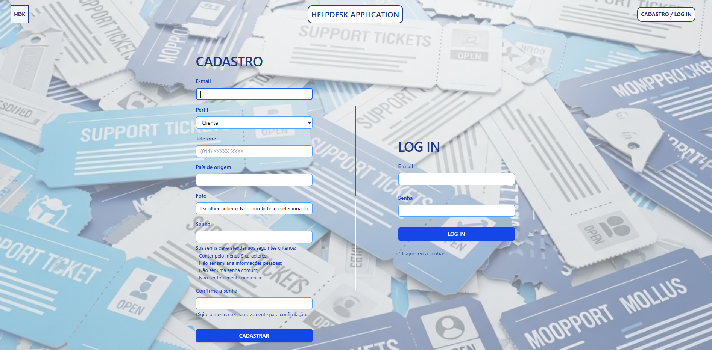
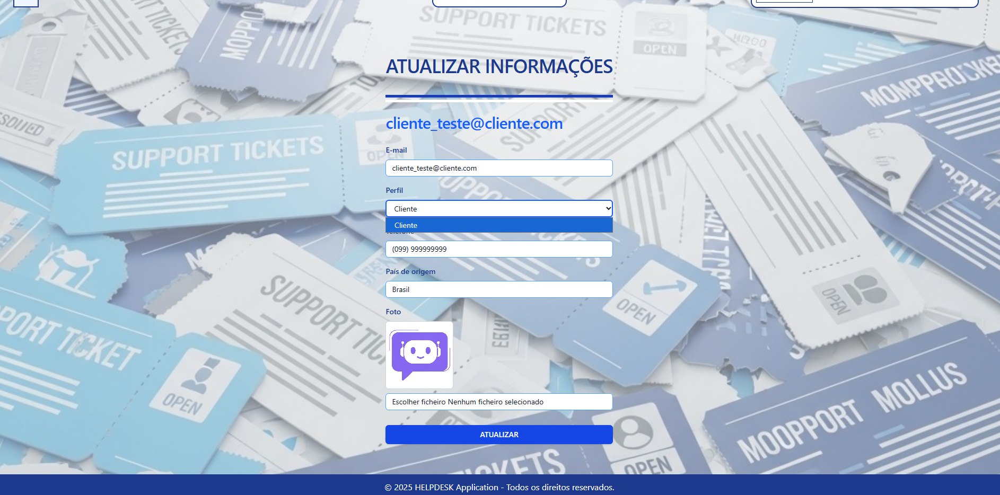

# App HELPDESK

Desenvolvida com **Python**, **Django** e **Django REST Framework** (Inclui API com autenticação via token para acesso seguro aos dados), utilizando **HTML** e **CSS**. 

A aplicação configura-se como um site de suporte ao cliente, utilizando tickets para comunicação entre membros da Staff e os Clientes.

OBS: O foco deste aplicativo é o uso direto das funções nativas do Django (utilizando por exemplo: User, UserManager, etc).

## Funcionalidades

- Cadastramento de usuários tipo cliente no site;
- Cadastramento de usuário tipo suporte, permitido apenas por membros da staff;
- Seção de cadastro e login de usuários (incluindo todas as validações nativas do Django);
- O acesso às funcionalidade do site (abertura de tickets / comunicação com a equipe de suporte), só ocorre com usuário logado;
- Os clientes possuem acesso apenas aos seus tickets, podendo enviar mensagens após a abertura dos mesmos, para algum complemento ou atualrizar informações para os membros da Staff;
- Os membros da Staff (Suporte), tem acesso geral ao site, incluindo todos os tickets abertos no site e permissão para criar usuários da equipe de Suporte;
- Funcionalidade de: Esqueceu a senha?, realizada através de envio de um e-mail para a redefinição de senha, com token de autenticação.

## Imagens da Aplicação

### Página Inicial - Sem login

### Página Inicial - Usuário Cliente logado

### Página Inicial - Usuário Suporte logado

### Cadastro de Usuários / Log in

### Cadastro de Usuários - Staff

### Informações do Usuário - Cliente

### Página de Esqueceu a senha? - Parte 1

### Página de Esqueceu a senha? - Parte 2

### Página de Esqueceu a senha? - Parte 3

### Página de Esqueceu a senha? - Parte 4

### Registrar Ticket  

### Detalhes do Ticket - Cliente  

### Detalhes do Ticket - Staff  

### Lista de Tickets - Cliente  

### Lista de Tickets - Staff  
